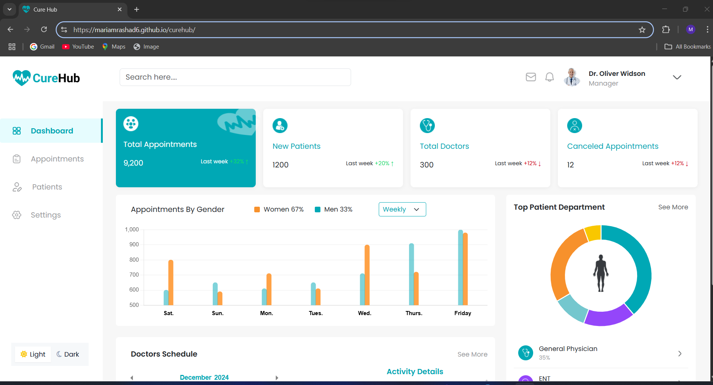

# CureHub

CureHub is a modern, responsive hospital management dashboard interface built using HTML, CSS, JavaScript, and Bootstrap. It offers a clean layout for managing patient information, documents and appointments, doctor schedules , ideal for front-end healthcare system simulations.

---

## Live Demo

You can view the project live here:  
🔗 [CureHub Live Demo](https://mariamrashad6.github.io/curehub/)



---

## Project Structure

```plaintext
curehub/
├── index.html                   # Main dashboard view
├── appointments.html            # All appointments details (appointment request , appointments list , doctor list , doctor schedule)
├── patients.html                # All patients's detail (personal info. , appointments , documents and prescription)
├── styles/
│   └── basicStyles.css          # Custom basic CSS styles common in all pages
│   └── appointmentStyle.css     # Custom CSS styles for appointments page
│   └── index.css                # Custom CSS styles for dashboard page
│   └── patient.css              # Custom CSS styles for patient page
├── scripts/
│   └── script.js                # JavaScript for interactivity for dashboard page
│   └── patients.js              # JavaScript for interactivity for patient page
│   └── appointmentscript.js     # JavaScript for interactivity for appointments page
├── images/                      # Images and icons for the project
```
---
## ✨ Features

- Dashboard showing quick summary and analysis of departments and appointments   
- Appointment page shpwing appointments details (appointment request , appointments list , doctor list , doctor schedule)
- Patients page patients's detail (personal info. , appointments , documents and prescription)
- Interactive UI with hover effects  
- Date selection with Pikaday and Flatpick
- Charts for analysis
---
## Technologies Used

- **HTML5**
- **CSS3**
- **Bootstrap 5**
- **JavaScript (Vanilla)**
- **Pikaday (Js Date Picker Library)**
- **Flatpickr (Js Date Picker Library)**
- **chart (JS Date Picker Library)**
---
## Installation
1. Clone the repository:
    git clone https://github.com/MariamRashad6/curehub.git
2. Navigate into the project:
    cd curehub
3. Open index.html in your browser.
--- 

## Author 
Mariam Rashad
GitHub: @MariamRashad6
